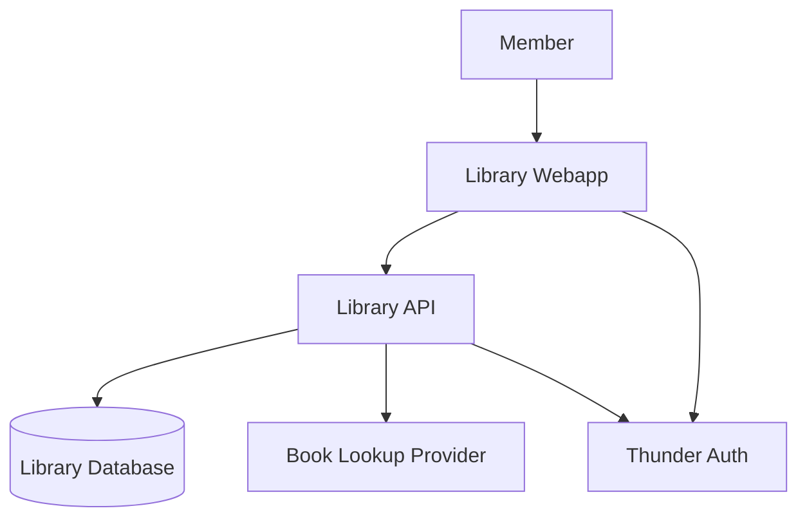
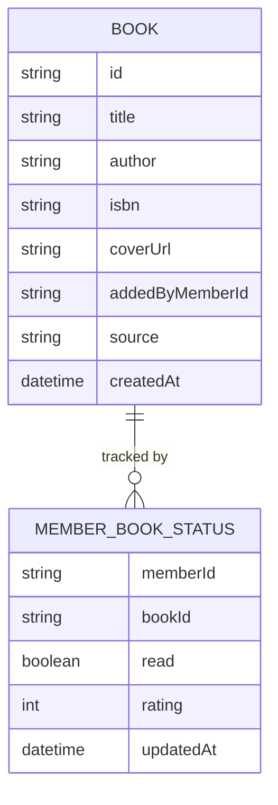
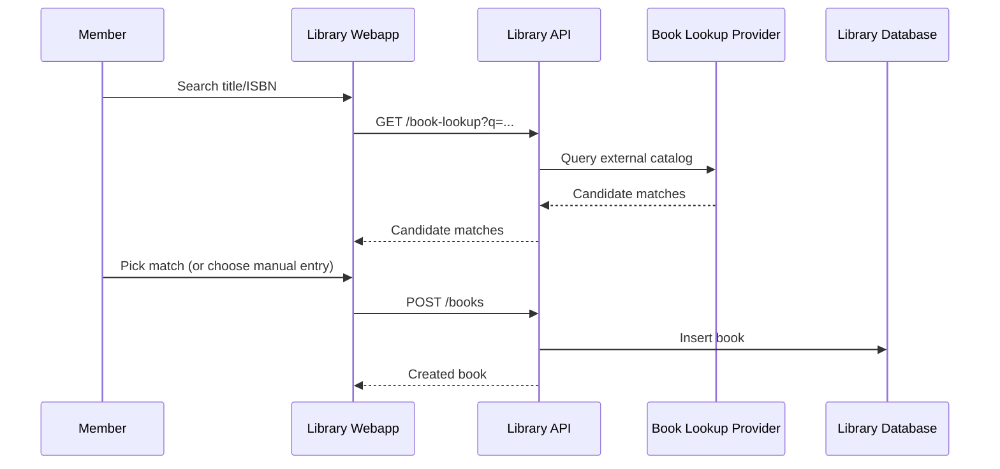
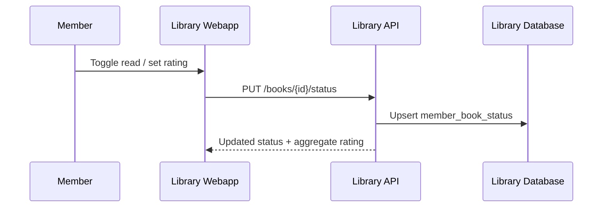

# Shared Library Catalog — Design

A shared-catalog reading tracker: any signed-in member can add a book — looked up by title or ISBN
against an external book database, with manual entry as a fallback — browse the full catalog, and
mark each book read/unread and rate it for themself. `library-webapp` is the SPA members use;
`library-api` owns the catalog and per-member state and is the only component that talks to the
book-lookup provider and the database.

## Context (C1)

## Domain model (ER)

`MEMBER_BOOK_STATUS` is keyed by `(memberId, bookId)` — one row per member per book, holding that
member's own read flag and 1–5 rating. A book's average rating and read count are computed by
aggregating this table, never stored redundantly.

## Key flows

### Add a book via lookup

### Mark read and rate

## Notes

- The book-lookup provider is a genuinely choosable third-party dependency (no requirement names a
vendor) — resolved as `candidates` on `library-api`'s design.json; see "Needs your input".
- Sign-in is via Thunder, shared by `library-webapp` and `library-api` under the same dependency name.

